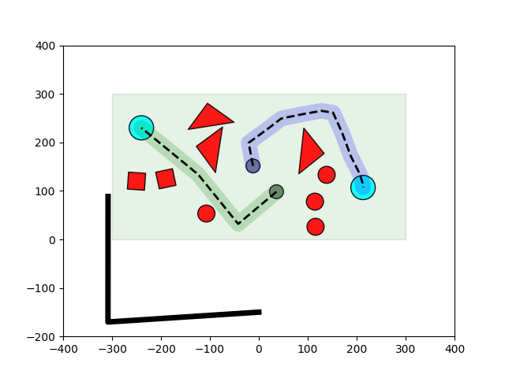

# Toy motion planner
This program performs motion planning for a 2D shape in a simple 2D toy environment with regular polygons as obstacles. It is a pure-software adaptation of a component from an applied robotics project. Credit to Benjamin Burgess-Limerick, Rudraksh Goel, and Jake Warren for their contributions to said project, including a minority portion of the code here.

Run a demo with `python main.py`

## Installation
The program has been run successfully in Python 2.7.15, 3.5.5 and 3.7.0, on Linux. Using the latest version of everything should be a safe bet.

pip
- numpy
- scipy
- sklearn
- matplotlib
